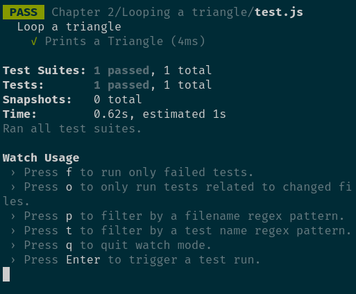

# Eloquest JavaScript Exercises

This project aims to help you practice the exercises form Eloquest JavaScript.

## How to setup

Clone the repo and install `node.js` then install the dependencies:

```
npm install
```

## How to get started

Go to the exercise and fill out your code. Run the tests to see if you passed:

```
  npm start
```

