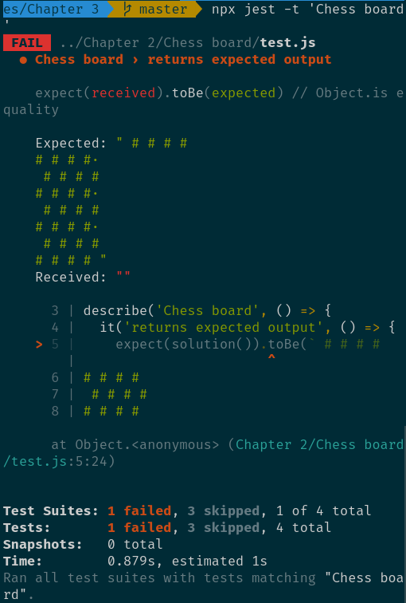

# Eloquest JavaScript Exercises

This project aims to help you practice the exercises form Eloquest JavaScript.

## How to setup

Clone the repo and install `node.js` then install the dependencies:

```
npm install
```

## How to get started

Go to the exercise and fill out your code. Run the tests to see if you passed:

```
  npm start
```


To run a specific exercise use `npx jest 'exercise-name'`. Here replace exercise name with the exercise you intend to test.



You can also append `--watch` to keep the test running and update against changes. For example `npx jest 'Minimum' --watch`

